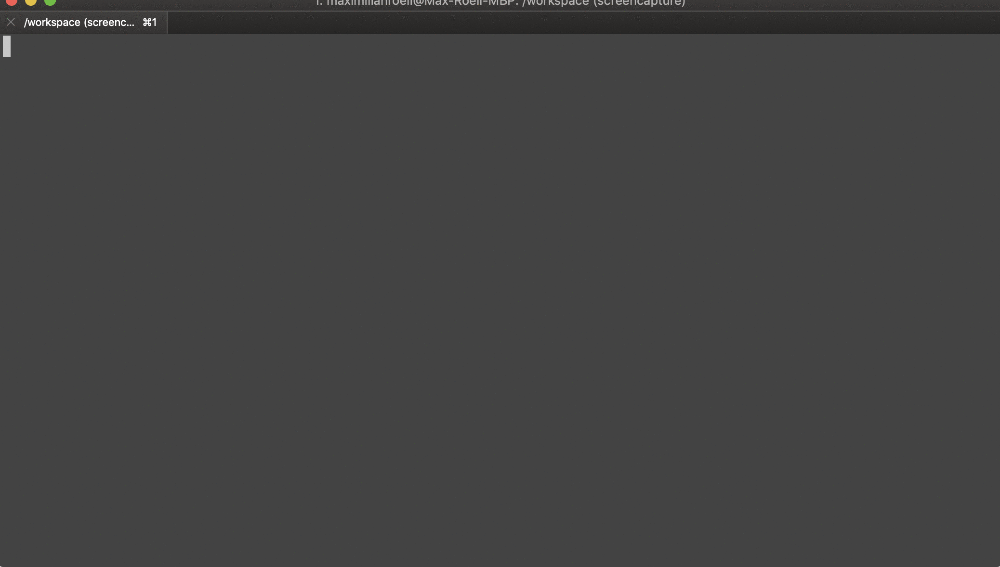

# roellsh 'rsh'
> make your dev life easier with rsh 100% Shell

## Requirements
bash shell (Linux or Mac OS X)

## Demo


## Install
install works for `zsh` and `bash`


``` bash
sh -c "$(curl -fsSL https://raw.githubusercontent.com/maxiroellplenty/roellsh/master/core/scripts/install.sh)"
```
